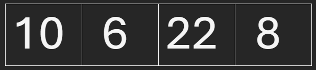
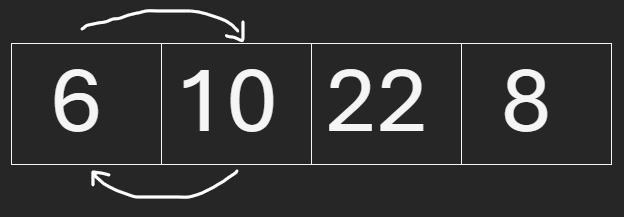
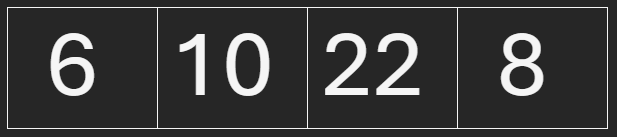
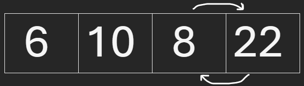
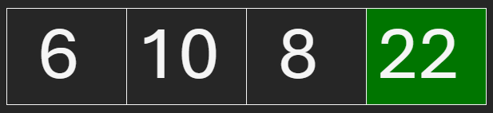

# Bubble Sort

Bubble Sort se trata de um algoritmo de ordenação que organiza uma lista de elementos tanto em ordem crescente quanto em decrescente.

## Como o Bubble sort funciona?

Imagine que temos uma lista de números inteiros e desejamos ordená-la de maneira crescente.

#### [10, 6, 22, 8]

Depois que nossa lista passar pelo Bubble Sort e ele for finalizado, ela ficará assim:

#### [6, 8, 10, 22]

Essa ordenação acontece quando comparamos 2 elementos adjacentes da seguinte forma: Se eles estiverem na ordem errada, trocam de posição.

## Passo a passo

* 1: Começamos a comparação a partir da 1° posição da lista

* 2: Comparamos o 1° item com o 2°

* 3: Se o primeiro for maior, então trocam de posição, senão, não fazemos nada (permanecem no mesmo lugar)

* 4: Repetimos os passos anteriores avançando para o próximo item na lista(o próximo seria a 2° posição).

## No nosso exemplo anterior, ficaria dessa forma:

Lista original:

---

Começamos a comparação com o número 10

Comparamos com o próximo da lista, o 6

Como 10 é maior que 6, eles trocam de posição

---

Continuamos a comparação com o 2° item da lista, sendo mais uma vez o número 10

Comparamos ele com o 22

Como 10 é menor que 22, mantém suas posições 

---

Comparação com o 3° item da lista, número 22

Comparamos ele com o 4º item da lista, número 8

Como 22 é maior que 8, eles trocam de posição

 

---

Após essas comparações, Nós conseguimos posicionar o maior número da lista (22) na sua devida posição

---

## Referências

[Vìdeo do canal do audibert](https://www.youtube.com/watch?v=UT8Z3U5gDsc&t=22s&pp=ygUnYnViYmxlIHNvcnQgbGluZ3VhZ2VucyBkZSBwcm9ncmFtYcOnw6Nv)